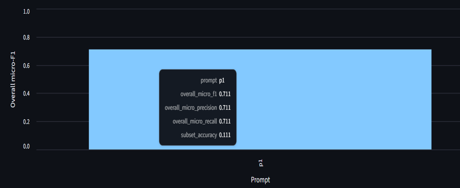
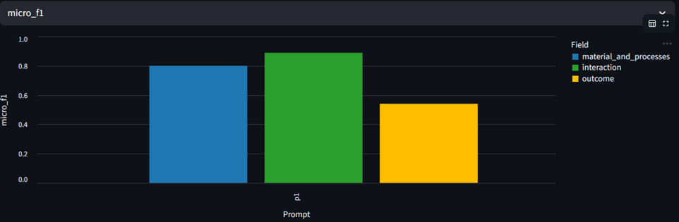

# Analysis

In this document, we detail the problems encountered when working with the LLM and the classification of the artworks.

## Prompt Selection Process

The process began with a simple prompt, whose essential components consisted of the framework definition and the source code of the artwork to be analyzed. Initially, the original framework was used; however, due to the lack of satisfactory results, it was replaced by the simplified framework described in the previous section.

Once the new framework was defined, the prompt evaluation phase was initiated. For prompt optimization, we employed the Automatic Prompt Engineering (APE) strategy, which enables the systematic exploration and comparison of multiple prompt variants.

The following figures present the results obtained from nine different prompt variants. These results were evaluated using the ground truth associated with each artwork, allowing for an objective assessment of the quality and accuracy of the model’s responses.

## Model Validation Methodology

All `74 artworks` in the dataset were processed by the `LLM`(LLAMA-3.1-70B model) in order to extract their corresponding sets of characteristics. Subsequently, `30 artworks` were randomly selected, for which a manual `ground truth` was constructed. This ground truth was then used to compare the expected values with those predicted by the model. All selected artworks were created in p5.js using a single file in each piece, which contains the program logic.

The first figure shows the `overall accuracy` of the model, while the second figure presents the `accuracy broken down by each framework dimension`, enabling a more detailed analysis of the model’s performance.

Values => Blue: 0.800; Green: 0.889; Yellow: 0.541

## Results and Analisys

The model made a mistake once and hallucinated by producing a characteristic that was not included in the framework defined in the prompt. The highest inaccuracy was observed in the `Interaction` dimension, where the model failed to correctly assign the `computer_interaction` value. This suggests that the term is too abstract under its current definition and would likely require `refinement` or `rewording` in order to reduce ambiguity and improve classification consistency.

Another important issue appeared in the `Outcome` dimension. The model frequently failed to assign the correct value and tended to confuse `static` and `time_based`. For instance, at the code level, the `draw()` function may run continuously within a loop; however, if the image remains unchanged across frames, the perceived result for viewers is essentially static. In contrast, from an execution standpoint, the system continues rendering over time. This mismatch highlights a discrepancy between computational behavior and perceptual outcome, which directly affects the classification criteria.

## Manual creation of the ground truth

The first ground truth manually created by me dates from 2025.11.25. In the file `manual-annotations-roxana.md`, I provide a summary of the values that I found confusing during the classification process. These mainly concerned the following categories:

- **Materials and processes**: `synthesized_image`, `synthesized_text`, and in some cases `randomness`.
- **Interactions**: `computer_interactions`.
- **Outcome**: confusion between `time-based` and `static`.

